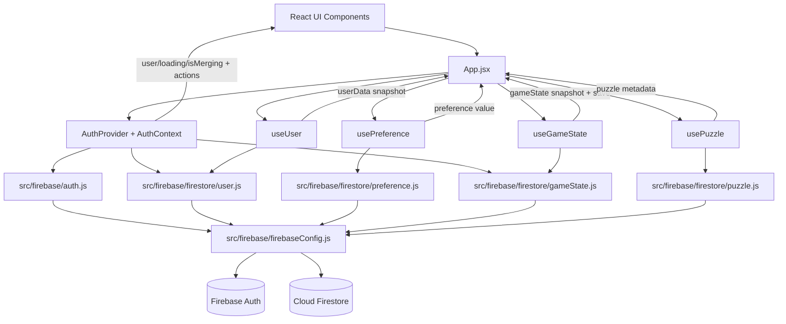
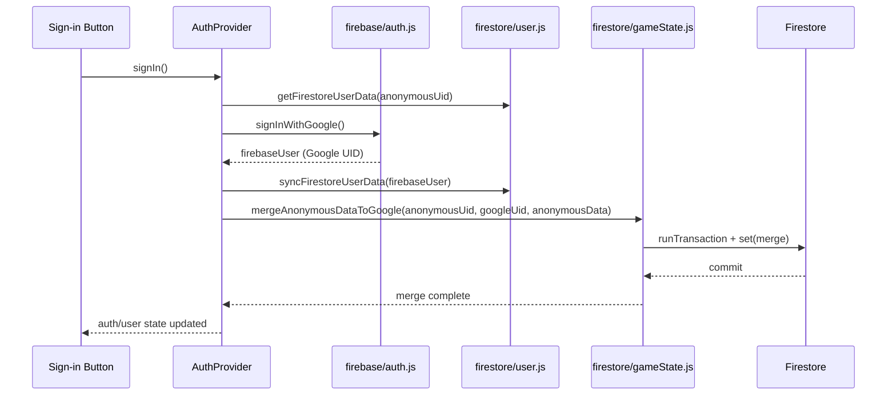

# Slidemoji Architecture Flow

This document shows how auth, React, hooks, and Firebase data modules interact.

## High-level Flow

## Sign-in Merge Sequence

## Layer Responsibilities

- React app layer:
    - [src/App.jsx](../src/App.jsx) orchestrates page state and composes hooks.
    - Components render UI only.
- Auth/context layer:
    - [src/contexts/AuthProvider.jsx](../src/contexts/AuthProvider.jsx) owns auth lifecycle, sign-in/out, and merge orchestration.
- Hook layer:
    - [src/hooks/useUser.js](../src/hooks/useUser.js), [src/hooks/usePreference.js](../src/hooks/usePreference.js), [src/hooks/useGameState.js](../src/hooks/useGameState.js), [src/hooks/usePuzzle.js](../src/hooks/usePuzzle.js) adapt backend data APIs to React state.
- Firebase data layer:
    - [src/firebase/auth.js](../src/firebase/auth.js) handles identity operations.
    - [src/firebase/firestore/user.js](../src/firebase/firestore/user.js), [src/firebase/firestore/preference.js](../src/firebase/firestore/preference.js), [src/firebase/firestore/gameState.js](../src/firebase/firestore/gameState.js), [src/firebase/firestore/puzzle.js](../src/firebase/firestore/puzzle.js) handle Firestore reads/writes/subscriptions.
    - [src/firebase/index.js](../src/firebase/index.js) is the export surface.
